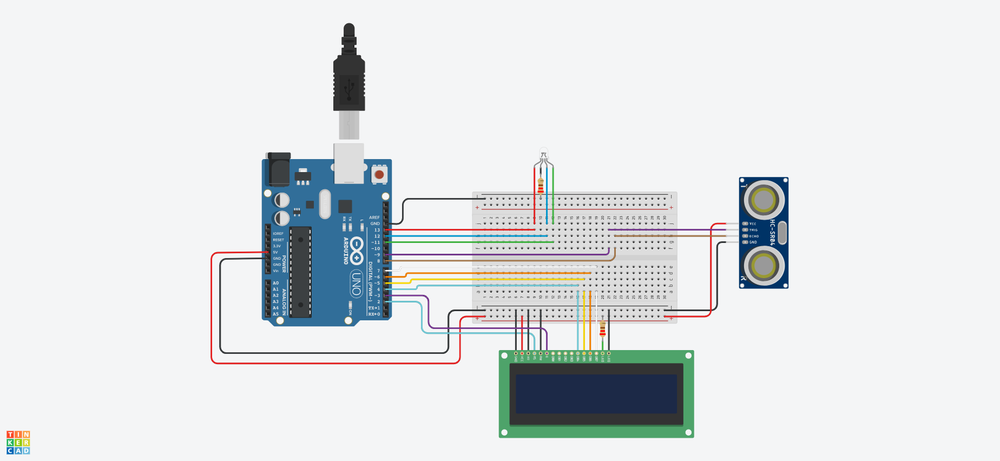

# Arduino Ultrasonic Sensor (HC-SR04)

An Arduino connected to a distance sensor that will change the color of the led based on how close is the objecte detected. The distance
will be showed in the LCD

# Components

* 1 Arduino Uno R3
* 2 Resistor 220Ω
* 1 RGB LED
* 1 Ultrasonic Sensor (HC-SR04)
* 1 LCD (16x2)

# Circuit

The Ultrasonic Sensor HC-SR04 is connected to the Arduino UNO. Once the Aruino is turned on, it will send an electric pulse to the trigger pin of the sensor for 10 microseconds to make it send sound waves. Once the sensor detects the waves come back, it will send a signal through the echo pin to the
Arduino board. This will allow calculate how far is the object. Depending on how close is it, the Led will change the color and the distance will be
displayed in the LCD

# Code

The code for Arduino can be found in the `src` directory. It's just a single file written in `C`.

# Simulation

[watch how it works in tinkercad](https://www.tinkercad.com/things/54n59yZg6If)

